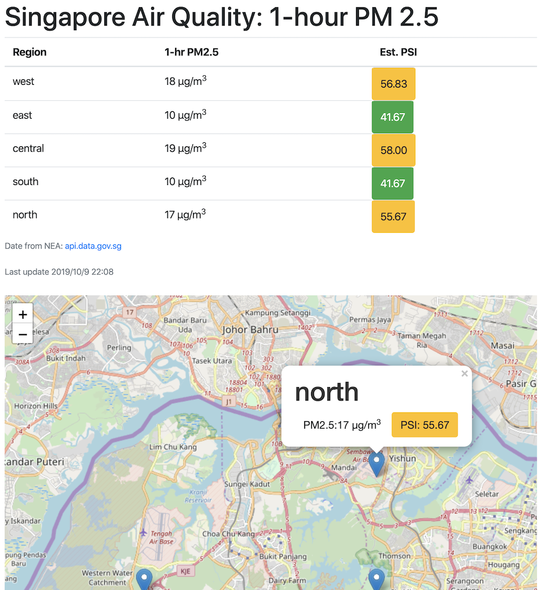

# Singapore_1hr_PM_25
Displays the 1-hour PM 2.5 readings obtain from from Singapore NEA (National Environment Agency)

## Getting Started
```
git clone git@github.com:JasonL888/Singapore_1hr_PM_25.git
```
Use browser to open the index.html file



## Implementation
* Uses Vue
  * with axios to obtain the NEA data from https://api.data.gov.sg/v1/environment/pm25
  * Vue2Leaflet and leaflet to integrate with openstreetmap
* Uses OpenStreetMap

## License
This project is licensed under the MIT License - see the [LICENSE.md](LICENSE.md) file for details

## Acknowledgements
Many thanks to the all the involved at
* Vue
* Vue2Leaflet
* Leaflet
* OpenStreetMap
* data.gov
* NEA
* bootstrap
